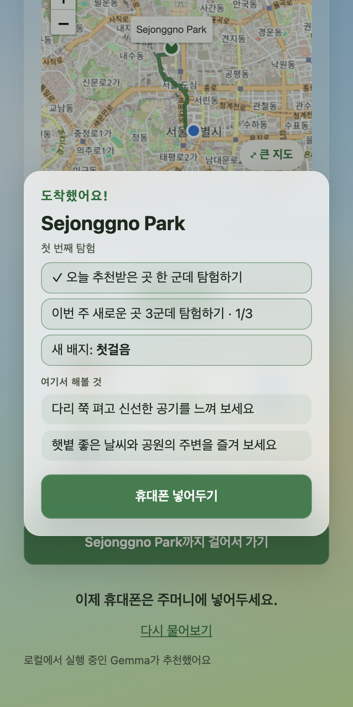
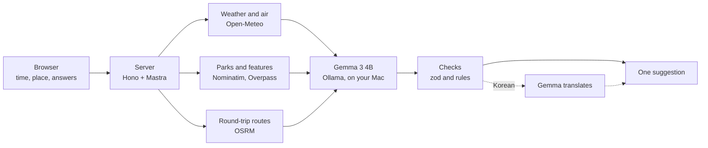

# Should I go out?

One tap, one suggestion, then put your phone away.

<p align="center">
  
  
</p>

<table>
  <tr>
    <td align="center" width="33%"><br><sub>Pick what you like, or skip</sub></td>
    <td align="center" width="33%"><br><sub>A short tour of each part</sub></td>
    <td align="center" width="33%"><br><sub>Home: time, city, check-in</sub></td>
  </tr>
  <tr>
    <td align="center" width="33%"><br><sub>One suggestion with things to do</sub></td>
    <td align="center" width="33%"><br><sub>The same in Korean</sub></td>
    <td align="center" width="33%"><br><sub>Round-trip route on a full map</sub></td>
  </tr>
  <tr>
    <td align="center" width="33%"><br><sub>What to wear, for people who run cold</sub></td>
    <td align="center" width="33%"><br><sub>Check in when you get there</sub></td>
    <td align="center" width="33%"><br><sub>Open it on your phone</sub></td>
  </tr>
  <tr>
    <td align="center" width="33%"><br><sub>You made it</sub></td>
    <td align="center" width="33%"><br><sub>Check-in in Korean</sub></td>
    <td align="center" width="33%"><br><sub>Your explorations</sub></td>
  </tr>
</table>

It checks the weather, the air, and the parks near you, and Gemma, running on your own computer, suggests one outdoor plan that fits the time you have. Then it tells you to put your phone away.

- **One plan, not a feed.** A park or landmark, a few things to do there, a round-trip route that fits your time, and what to wear.
- **Made for you.** Four quick questions on your first visit, or let the AI decide. Don't like the place? Tap "Another place".
- **Counts only when you go.** "I'm here" checks you in at the place. Goals and badges move only when you actually go somewhere; there are no points and no leaderboard.
- **Preview your walk.** A music video of about 30 seconds that flies over the real streets to the park, to save or share.
- **Local AI.** Gemma runs on your computer through Ollama: no AI service, no key, no cost. Check-ins compare your location in the browser and never send it.
- **Take it outside.** Open it on your phone from your Mac over Tailscale; check-ins work even with no signal.
- **English and Korean.** It follows your browser's language, and one tap switches it.

## Run locally

Using an AI coding agent? Ask it to set up the project from [AGENTS.md](AGENTS.md). It installs and starts everything, checks that it works, and gives you links for the optional API keys.

Requirements: Node 22.13+, pnpm, [Ollama](https://ollama.com).

```bash
ollama pull gemma3:4b
ollama serve            # keep running

cp apps/server/.env.example apps/server/.env
pnpm install
pnpm dev                # web on http://localhost:5173, API on :8787
```

Optional keys go in `apps/server/.env`. The app works everywhere without them.

| Variable | What it adds | What leaves your machine |
|---|---|---|
| `SEOUL_OPEN_API_KEY` | Ddareungi (Seoul public bike) stations within 500 m, and places that fit by bike, when you answered yes to "Public bikes?" and have 30+ minutes | Nothing about you; the full station list is downloaded and filtered on the server |
| `MAPILLARY_ACCESS_TOKEN` | Real photos of the park near the end of the walk preview (a free client token from the [Mapillary developer dashboard](https://www.mapillary.com/dashboard/developers)) | When you open the preview: the park's location and where the route meets it (Mapillary), and the park's location and name (Wikimedia Commons) |
| `SENTRY_DSN` | A trace of every request, workflow step, Gemma call, and outgoing API request, with latency and tokens | Your location, your answers, and the prompt; the Seoul key is masked |

Opening the walk preview also loads map tiles for the area around your route from [OpenFreeMap](https://openfreemap.org) (free, no key). [How it works](docs/how-it-works.md#optional-services-and-your-data) has the details.

### Use it on your phone

Gemma runs on your Mac, so your phone opens the app from the Mac over [Tailscale](https://tailscale.com), a private network between your own devices. The browser only shares your location over HTTPS, and `tailscale serve` provides HTTPS with a certificate for a `*.ts.net` name.

1. Install Tailscale on the Mac and the phone ([download](https://tailscale.com/download)) and sign in to the same account on both. On the Mac, make sure the [`tailscale` command](https://tailscale.com/kb/1080/cli) works.
2. Run `pnpm phone` instead of `pnpm dev`. It builds the web app and serves it on 127.0.0.1:4173, with the API on :8787, and prints the next step: how to install Tailscale if the `tailscale` command isn't found, or the address when it's already shared.
3. In another terminal, run `tailscale serve --bg 4173`. The first time, it asks you to turn on HTTPS certificates for your tailnet; follow the link. It then prints the address, like `https://my-mac.tail1234.ts.net`.
4. Open that address on the phone.

The Mac has to stay awake and online for suggestions, because Gemma runs there; if the phone can't reach it, the app says so. Checking in doesn't need the Mac: once the app has loaded on the phone, it opens again without a connection, so "I'm here" works in a park with no signal or while the Mac sleeps. The address only works on devices signed in to your tailnet and isn't on the public internet. Tailscale's coordination server knows your devices and when they connect, but the traffic between them is end-to-end encrypted. Sharing stays on after a restart until you run `tailscale serve reset`.

### Code style

Code style is checked with [Biome](https://biomejs.dev) (`biome.json`): `pnpm format` formats the code, `pnpm check` checks formatting, lint, and import order, and `pnpm check:fix` fixes what it can. `pnpm typecheck` runs the type check, Biome lint, and the nested-ternary check. In VS Code or Cursor, install the [Biome extension](https://marketplace.visualstudio.com/items?itemName=biomejs.biome) to format and apply safe fixes on save, which also removes unused imports (`.vscode/settings.json`).

## How it works



1. **Only real places that fit.** The server finds parks near you (Nominatim), what they have (Overpass), and the weather and air (Open-Meteo), then measures the real round trip to each park with OSRM. Parks that don't fit your time are dropped before Gemma sees them.
2. **Gemma picks, the server checks.** A Mastra agent asks Gemma 3 4B for one park, things to do, and an outfit from a fixed list. The server drops things to do that name a facility the park doesn't have and reasons that don't match the weather, and switches parks when Gemma's pick matches none of your answers but another park does. If Gemma fails, simple rules answer instead.
3. **Your answers and history count.** Answers rank parks by what they have (with kids, a playground). Places you've checked in at go with the next request, so Gemma prefers somewhere new. Bikes come up only if you said yes to public bikes (in Seoul, with a key).
4. **Korean without weakening the checks.** Gemma always answers in English, because the checks match English words. A second Gemma call translates the checked answer, with place names masked so they stay as they are.
5. **Reuse instead of repeat.** One in-memory cache keeps the same suggestion for 10 minutes, weather within about 1 km for 10 minutes, and place searches and routes for a day. A six-step session went from 58.8 s to 39.2 s ([benchmark](docs/benchmarks/caching.md)).
6. **Check-ins stay on the device.** "I'm here" compares your location with the place in the browser, and nothing is sent. The built app keeps working offline, so you can check in with no signal.
7. **The walk preview is made in the browser.** MapLibre draws a 3D flyover on OpenFreeMap tiles, the Web Audio API makes the music, and MediaRecorder records both into a video.

With `SENTRY_DSN` set, each suggestion shows up in Sentry as one trace:

<p align="center"></p>

Every limit, timeout, and cache lifetime is in [docs/how-it-works.md](docs/how-it-works.md).

## Agent sessions

This app was built with Cursor agents. [Entire](https://entire.io) records each agent session from Cursor, Claude Code, or Codex and links it to the commit it produced. The checkpoints go to a separate private repository, `scs0209/touch-grass-agent-checkpoints`, so transcripts stay private until reviewed while the code stays public here. Early sessions are mostly in Korean; since October 6, 2026 the agent answers in both English and Korean.

The rules for agents live in one file, [AGENTS.md](AGENTS.md): keeping secrets out of sessions, English and Korean answers, English commit messages, fixing gaps before reporting, and keeping this README in sync. Cursor and Codex read it directly, and Claude Code reads it through `CLAUDE.md`.

To record and read sessions on another machine, sign in to GitHub with access to that repository and enable Entire once:

```bash
brew install --cask entireio/tap/entire
entire enable --agent cursor   # or claude-code, codex; installs the git hooks (agent hooks are already in the repo)
entire checkpoint list         # fetches checkpoints from the private repository
```

Without Entire installed, the Entire hooks do nothing. Cursor (`.cursor/hooks.json`), Claude Code (`.claude/settings.json`), and Codex (`.codex/hooks.json`) also share a stop hook, `scripts/readme-check.mjs`. It reminds the agent once to check this README and [docs/how-it-works.md](docs/how-it-works.md) when code under `apps/` changed and neither did. Codex asks you to trust the hook once with `/hooks`.

## Credits

- Clothing and weather icons: [Fluent Emoji](https://github.com/microsoft/fluentui-emoji) 3D by Microsoft, MIT ([license](apps/web/public/fluent-emoji/LICENSE)).
- Glass styling: the glassmorphism skill and `apps/web/src/styles/glass-tokens.css` come from [fengshao1227/ccg-workflow](https://github.com/fengshao1227/ccg-workflow), MIT ([license](.agents/skills/glassmorphism/LICENSE)).
- Map tiles, parks, park features, and city names Open-Meteo doesn't know: © [OpenStreetMap](https://www.openstreetmap.org/copyright) contributors, via Nominatim and the [Overpass API](https://overpass-api.de).
- Walking and cycling routes: [OSRM](https://project-osrm.org) on FOSSGIS's [routing.openstreetmap.de](https://routing.openstreetmap.de).
- Weather, air quality, and city search: [Open-Meteo](https://open-meteo.com) (CC BY 4.0).
- Seoul public bikes: [Seoul Open Data Plaza](https://data.seoul.go.kr).
- Walk preview map: 3D map tiles from [OpenFreeMap](https://openfreemap.org) ([OpenMapTiles](https://openmaptiles.org) schema, © OpenStreetMap contributors), rendered with [MapLibre GL JS](https://maplibre.org) (BSD-3-Clause).
- Walk preview photos: street-level photos of the park by [Mapillary](https://www.mapillary.com) contributors (CC BY-SA 4.0) and park photos from [Wikimedia Commons](https://commons.wikimedia.org) under each author's license; the film's last shot names the map sources, photographers, and licenses.
- Walk preview editing: the photo cards, word-by-word titles, underline and chip end card, reading-time and shot-length rules follow the editing ideas in [OpenMontage](https://github.com/calesthio/OpenMontage) (AGPL-3.0); no code was copied, and the film is still drawn on a canvas in the browser.
- Model (suggestions and their Korean translation): [Gemma](https://ai.google.dev/gemma) by Google, under the [Gemma Terms of Use](https://ai.google.dev/gemma/terms).
