# Should I go out?

One tap, one suggestion, then put your phone away.

<p align="center">
  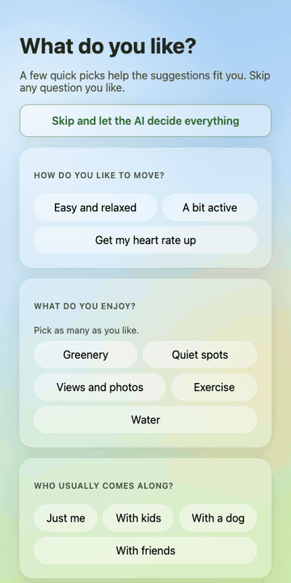
  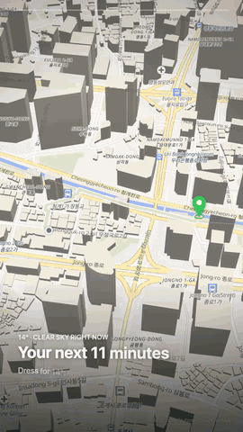
</p>

<p align="center">
  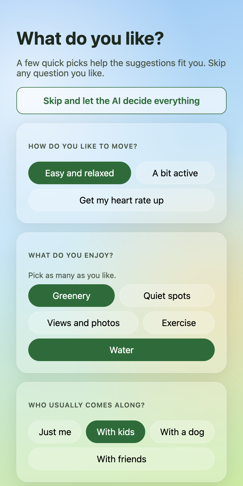
  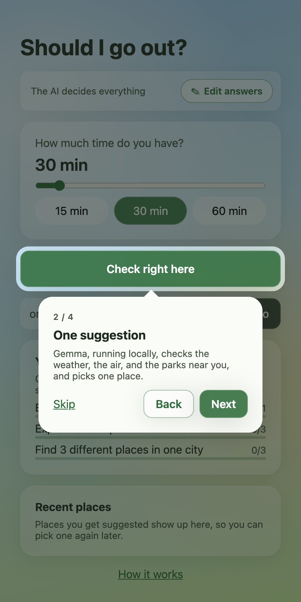
  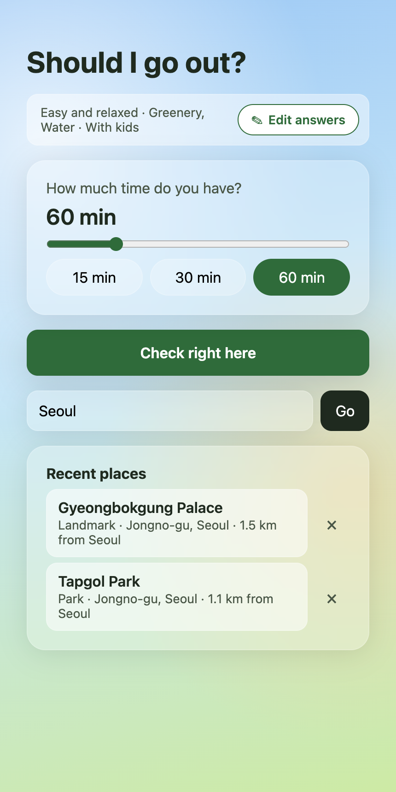
  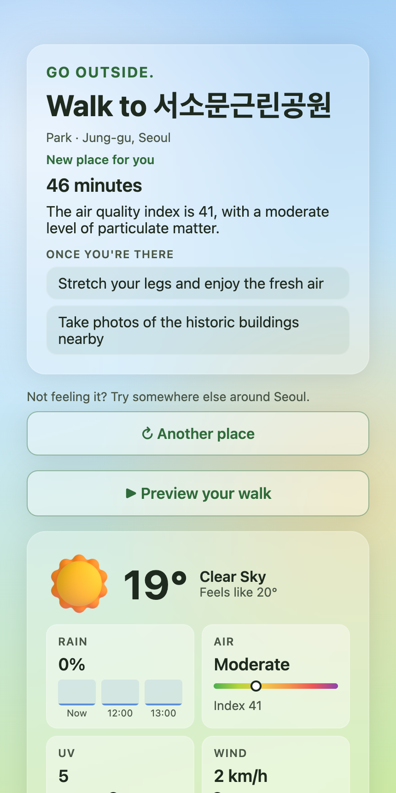
  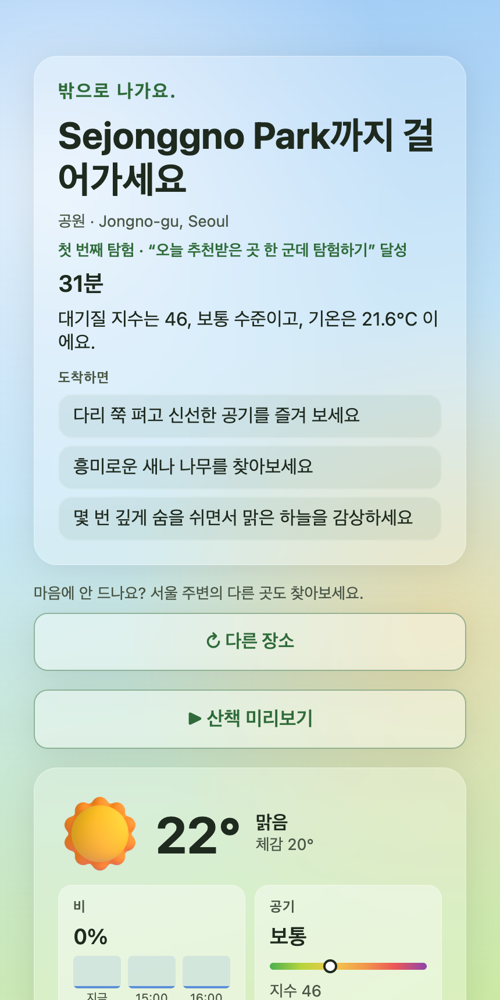
  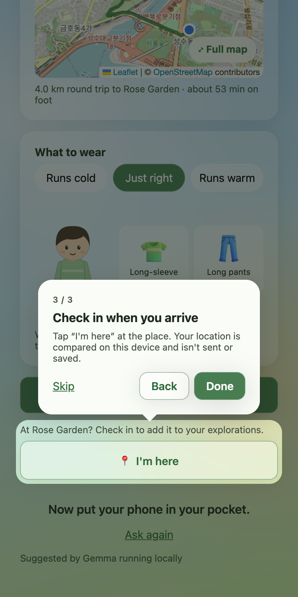
  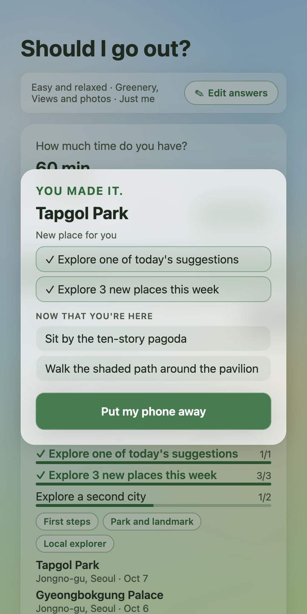
  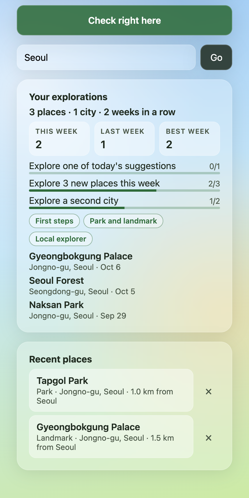
  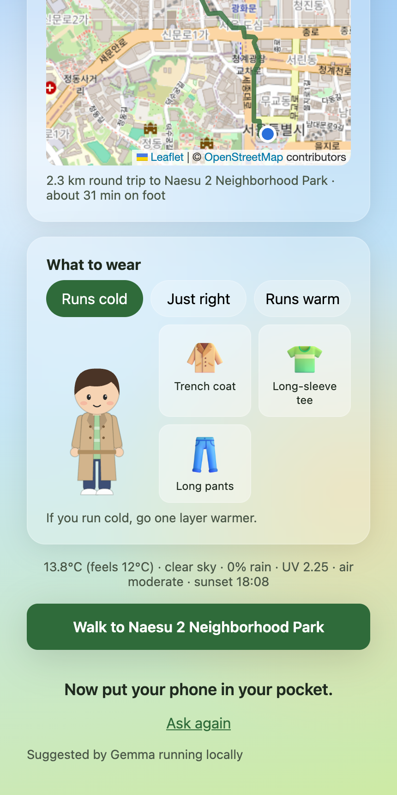
  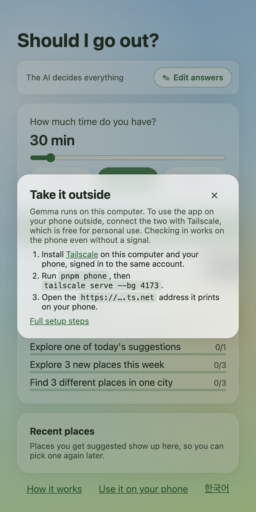
  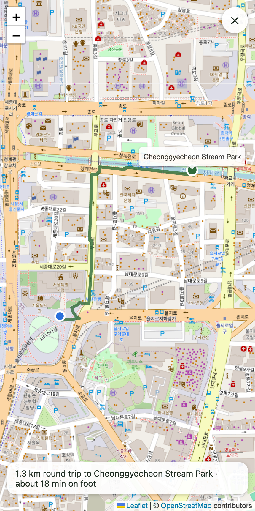
</p>

On your first visit, a short questionnaire asks how you like to move, what you enjoy, who usually comes along, and whether you ride public bikes; you can also skip it and let the AI decide everything. A short tour then points at each part of the home screen one step at a time, and another at the preview, the directions, and "I'm here" on your first suggestion; "How it works" at the bottom of the home screen plays them again. The app then checks the weather, air quality, nearby parks, and (in Seoul, if you said yes to public bikes) bike stations, and asks Gemma running locally through Ollama to pick a single outdoor activity that fits the time you have and your answers. It suggests a few things to do once you get there, shows a round-trip walking route on a map (tap "Full map" to open it over the whole screen), and dresses an avatar for the weather. Not keen on the place? Tap "Another place" for a different park or landmark around the same city, without the ones you've already seen. Every suggested place is kept under "Recent places" on the home screen, so you can pick it again later. Once you get there, tap "I'm here" to check in: your location is compared with the place on your device, and the place joins "Your explorations", with a few goals that only going somewhere can move (3 new places this week, a second city), simple badges, and this week next to your last and best weeks. Places you've explored are sent with your next request, so Gemma picks somewhere new, and the card says what a new place would be for you, like "First place in Busan". Tap "Preview your walk" to watch a music video of about 30 seconds of the outing that you can save or share: a 3D flyover of the real streets from your door to the park, following you along the route, circling the park, showing real photos of it when a Mapillary token is set, and ending on when to leave and be back (with "Your first exploration" or a similar line above it when the place is new to you). If the 3D map can't load, it is an illustrated story instead (getting dressed, the route, the park, and each thing to do). To take it outside, open it on your phone from your Mac over Tailscale ([Use it on your phone](#use-it-on-your-phone)); checking in works there even without a signal. On the Mac, "Use it on your phone" next to "How it works" shows these steps. The app speaks English and Korean: it follows your browser's language, and the link at the bottom of the home screen and the questionnaire ("한국어" or "English") switches it. In Korean, Gemma still writes the suggestion in English so the server can check it, and a second Gemma call then translates it, which adds a few seconds; place names stay as they are.

## Run locally

Using an AI coding agent? Ask it to set up the project from [AGENTS.md](AGENTS.md). It installs and starts everything, checks that it works, and gives you links for the optional API keys.

Requirements: Node 22.13+, pnpm, [Ollama](https://ollama.com).

```bash
ollama pull gemma3:4b
ollama serve            # keep running

cp apps/server/.env.example apps/server/.env
pnpm install
pnpm dev                # web on http://localhost:5173, API on :8787
```

Set `SEOUL_OPEN_API_KEY` in `apps/server/.env` to include Ddareungi (Seoul public bike) stations within 500m, and parks or landmarks too far to walk that fit by bike, when you answered yes to "Public bikes?" and have 30 minutes or more. Without it the app still works everywhere.

Opening the walk preview loads map tiles for the area around your route from [OpenFreeMap](https://openfreemap.org) (free, no key), so that area is visible to it; nothing is loaded until you open the preview.

Set `MAPILLARY_ACCESS_TOKEN` (a free client token from the [Mapillary developer dashboard](https://www.mapillary.com/dashboard/developers)) to show real photos of the park near the end of the walk preview. When you open the preview, the park's location and the point where the route meets it are sent to Mapillary, and the park's location and name to Wikimedia Commons; nothing is sent until then. Without it the flyover stays on the map.

Set `SENTRY_DSN` to send traces to Sentry. Each request then shows up as one trace with the four workflow steps, the agent run, the Gemma call, and every outgoing API request, including latency and token usage. The traces include step inputs and outputs, so your location, your questionnaire answers, and the prompt leave your machine; the Seoul API key is masked in request URLs, and the Mapillary token is sent in a header, not the URL. Leave it empty and nothing is sent.

<p align="center">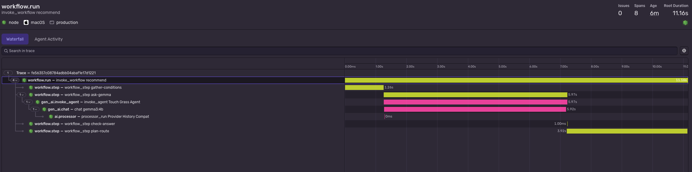</p>

### Use it on your phone

Gemma runs on your Mac, so your phone opens the app from the Mac over [Tailscale](https://tailscale.com), a private network between your own devices. The browser only shares your location over HTTPS, and `tailscale serve` provides HTTPS with a certificate for a `*.ts.net` name.

1. Install Tailscale on the Mac and the phone ([download](https://tailscale.com/download)) and sign in to the same account on both. On the Mac, make sure the [`tailscale` command](https://tailscale.com/kb/1080/cli) works.
2. Run `pnpm phone` instead of `pnpm dev`. It builds the web app and serves it on 127.0.0.1:4173, with the API on :8787, and prints the next step: how to install Tailscale if the `tailscale` command isn't found, or the address when it's already shared.
3. In another terminal, run `tailscale serve --bg 4173`. The first time, it asks you to turn on HTTPS certificates for your tailnet; follow the link. It then prints the address, like `https://my-mac.tail1234.ts.net`.
4. Open that address on the phone.

The Mac has to stay awake and online for suggestions, because Gemma runs there; if the phone can't reach it, the app says so. Checking in doesn't need the Mac: once the app has loaded on the phone, it opens again without a connection, so "I'm here" works in a park with no signal or while the Mac sleeps. The address only works on devices signed in to your tailnet and isn't on the public internet. Tailscale's coordination server knows your devices and when they connect, but the traffic between them is end-to-end encrypted. Sharing stays on after a restart until you run `tailscale serve reset`.

Code style is checked with [Biome](https://biomejs.dev) (`biome.json`): `pnpm format` formats the code, `pnpm check` checks formatting, lint, and import order, and `pnpm check:fix` fixes what it can. `pnpm typecheck` runs the type check, Biome lint, and the nested-ternary check. In VS Code or Cursor, install the [Biome extension](https://marketplace.visualstudio.com/items?itemName=biomejs.biome) to format and apply safe fixes on save, which also removes unused imports (`.vscode/settings.json`).

## How it works

- `apps/server/src/conditions/` fetches Open-Meteo weather and air quality, parks (and, when you ask for another place, landmarks) within walking range, or riding range with public bikes, from Nominatim, what each park has (playground, water, viewpoint, and so on) from Overpass, walking and cycling routes from OSRM (all keyless), and Seoul bike stations. The public Overpass server is often slow, so the app waits at most 3 seconds for it, lets the request keep going for up to 25 seconds in the background, and caches park features for a day, so the next request for the same parks has them.
- Parks are first searched by straight-line distance, assuming paths are about 1.3 times longer. One OSRM request then measures the real round trip to every park (at the same time as the features lookup, also waiting at most 3 seconds), and parks whose walk there and back takes longer than the time you chose are dropped before Gemma picks. The card's time always covers the real route shown on the map. For a bike suggestion, the route is the walk to the station, the ride to the park and back (OSRM's bike profile), and the walk home, plus 2 minutes to rent and return the bike; the map marks the station with a bike icon and draws the walks to and from it as dashed lines and the ride as a solid line, the map caption and the preview show the riding and walking minutes, and the directions button opens cycling directions through the station.
- When you said yes to public bikes and a nearby station has bikes, a second Nominatim search (at least one second after the first, as its usage policy asks) looks for places too far to walk, of the same kind as on foot (parks, or landmarks after "Another place"). The bike trip to each is measured from the closest station with bikes, and up to 3 of the farthest that fit your time are offered to Gemma as bike-only places. If Gemma picks one without a station, the server adds that station and names the trip a ride; if it picks a station but describes a walk to a walkable park, the trip stays a walk.
- "Another place" asks the server again from the same starting point (your location, or the center of the city you typed, which stays in the box) with the names of the places already suggested, so Nominatim's next results take their place. The first suggestion is always a park; asking again after a park looks for landmarks (Nominatim's tourist attractions that have a Wikidata entry, leaving out indoor ones like museums and malls), and after a landmark for parks again, so the two take turns, on foot and by bike alike; when one kind runs out, the other stands in. When no new place fits the time, the current one stays and the card says so. Nominatim answers are cached for a day, so asking again doesn't repeat the same search. Each place carries its city and district from Nominatim's address details.
- Every suggested place is saved in the browser's localStorage under "Recent places" (newest first, up to 10; the same place suggested again moves to the top instead of being listed twice), with its kind, district and city, the starting point it was suggested from, whether it was a bike trip, where the route meets it, and the things to do there. Tapping one suggests that place again from the same starting point, even if the trip takes longer than the time you set now (the card shows the real time). A former bike trip is ridden again from the closest station with bikes when you still ride public bikes, whatever the time you set, and walked otherwise; ✕ removes it.
- Checking in is the only way a place counts as explored. "I'm here" shows on the home screen and under the directions for places suggested in the last 24 hours that you haven't checked in at since. It asks for a fresh, precise location and accepts it within 300 m of the place or of where its route meets it, plus the reported accuracy up to 100 m; otherwise it says how far away you are. The location is only compared in the browser and is neither sent nor saved: the visit keeps the place's own name, kind, district, city, and coordinates, and the time (localStorage, up to 500). On arrival, the card shows whether the place is new to you, the goals it moved, any new badge, and the things to do there again, then "Put my phone away".
- In the built app (`pnpm phone`), a service worker (`apps/web/public/sw.js`, registered by `services/offline.ts`) keeps the page and its scripts and styles in the browser's cache, so check-ins work offline. The page is asked from the network first and the saved copy opens when there's no answer within 4 seconds; files under `/assets/`, whose names change with each build, and the emoji icons are served from the cache once saved, and a new build replaces the old files. `/api`, map tiles, and photos are never saved, so suggestions and the preview need the Mac. A suggestion request gives up after 90 seconds, longer than Gemma's first load, and says the server can't be reached.
- "Use it on your phone" (`apps/web/src/components/PhoneHint.tsx`) opens the phone steps in a dialog (Esc or ✕ closes it). It only shows when the app is open at `localhost`, `127.0.0.1`, or `[::1]`, so never on the phone itself.
- Every word on screen comes from `apps/web/src/i18n/` (`en.ts`, and `ko.ts`, which TypeScript checks has every key). The first visit picks Korean when the browser lists Korean among its languages and English otherwise; the switch saves the choice in localStorage and sets the page's `lang`. The server's sky descriptions and air quality levels are translated in the browser, dates follow the language, and the walk preview's captions and their reading time (about 13 characters a second in English, 7 in Korean) do too. A message already on screen, like an error, is cleared when you switch.
- Requests carry the language. Gemma always answers in English, because the server checks its answer with English word lists (rain, facilities, bikes, other places). For Korean, `apps/server/src/translate.ts` then sends the activity, reason, things to do, safety note, and outfit tip to Gemma as one JSON list, with the place and station names swapped for placeholders so they can't be translated or romanized. The answer must have as many items, all in Korean, with the same placeholders and every number from the English; otherwise it asks once more and then returns the English. The fixed outfit tips are translated without Gemma. Translations are cached for 6 hours, and both languages share the same English suggestion from the cache, so switching language and asking again only waits for the translation. Recent places and check-ins keep the things to do in the language they were suggested in.
- "Your explorations" counts different places and cities, compares this week with last week and your best week, and keeps a streak in weeks (starting Monday) rather than days. The goals are one of today's suggestions, 3 new places this week, 3 different places in one city, a second city, and both a park and a landmark; reached lasting goals become badges, along with 1, 5, and 10 places and 3 weeks in a row. There are no points, and nothing is compared with other people.
- The names of places you explored within 50 km of the starting point (up to 200) go with each request. Each park Gemma sees carries `explored`, and the prompt asks for a new place when one suits you about as well; if Gemma still picks an explored park while an unexplored one matches your answers as well, the server switches to it, and the rule-based fallback ranks the same way. The card says what the place would be for you ("Your first landmark", "First place in Busan", "New place for you", or when you were last there) and which goal a check-in would complete or move, and the preview's ending shows the same first line above "Ready when you are."
- Things to do at the park may only mention facilities that OpenStreetMap shows there; the server drops any suggestion that names a missing facility or another place.
- The reason is checked against the measured conditions: a sentence whose temperature, rain chance, air quality index, UV, or wind doesn't match, or that mentions rain when the chance is low (or denies it when rain is likely), is dropped.
- `apps/server/src/agent.ts` is a Mastra agent pointed at Ollama's OpenAI-compatible endpoint. The model only picks from real candidate parks and a fixed clothing catalog, so it never invents coordinates or items.
- `apps/server/src/outfit.ts` builds a baseline outfit from the Korean feels-like temperature chart; the model may adjust it, but rain, air quality, UV, and cold extras are always kept. It also offers one layer warmer and one layer lighter for people who run cold or warm.
- `apps/server/src/workflow.ts` runs each request as a Mastra workflow with four steps: gather conditions, ask Gemma for a JSON suggestion, check the answer with zod (falling back to simple rules if the model is unavailable or returns invalid output), and plan the walking route. The route was already measured while gathering conditions, so the last step reuses it from a day-long cache. The step logic lives in `apps/server/src/recommend.ts`.
- Work that was already done once is reused instead of repeated (`apps/server/src/cache.ts`: an in-memory cache that shares one request between callers asking for the same thing at the same time and forgets failures at once). The same request (starting point within about 10 m, time, answers, places already seen, places explored, and picked place) gets the same suggestion for 10 minutes without asking Gemma again; a bike suggestion only for 2 minutes, because bike counts change, and a rule-based fallback isn't kept, so the next request tries Gemma again. Weather and air quality are shared within about 1 km for 10 minutes. A request to Open-Meteo that hangs for 5 seconds or gets a server error is tried once more, and if that fails too, a reading up to 30 minutes older stands in. Nominatim searches, routes, and park features are kept for a day, so picking a recent place again or exploring the same city reuses them. Bike stations are never cached. In the browser, a typed city's coordinates are remembered until the page closes. Cities are looked up with Open-Meteo's geocoder in the browser; when it finds nothing, as with Korean names like "서울", the browser asks `GET /api/geocode`, which searches Nominatim on the server (with the same one-request-per-second limit and day-long cache) and the card uses the name you typed. [docs/benchmarks/caching.md](docs/benchmarks/caching.md) measures the difference: reopening a preview went from 5.5 s to 4 ms, searching the same city again from 10.3 s to 0.1 s, and a whole session's wait from 58.8 s to 39.2 s.
- Questionnaire answers are saved in the browser's localStorage and sent with each request. Gemma uses them to choose among the real parks, and parks are ranked by matching features (exercise prefers a sports field or track, kids prefer a playground). If Gemma picks a park known to match none of the answers while another park does, or names a park that isn't on the list, the server switches to the best listed park; the rule-based fallback uses the same ranking. Riding is a matter of taste, so bike stations are looked up only when you answered "Happy to ride a bike"; without that answer (including "let the AI decide everything") every suggestion is a walk.
- `apps/web` shows the questionnaire on the first visit, the suggestion with things to do, a weather panel (sky icon, hourly rain chance for the next 3 hours, air quality, UV, wind, and sunset), the route with Leaflet + OpenStreetMap (with a "Full map" button that opens it full screen with scroll and pinch zoom; Esc or ✕ closes it), and the outfit as a layered SVG avatar next to item cards.
- The tours (`apps/web/src/components/Tour.tsx`) dim the screen around one element at a time and point a card at it from below, or from above when there's no room, with Skip, Back, and Next (Esc skips); a step whose element isn't on screen is left out. Finishing or skipping a tour is remembered in localStorage, so each shows once, and editing your answers doesn't bring it back.
- "Preview your walk" ("Preview your ride" for bike trips, `apps/web/src/components/WalkPreview.tsx`) plays the 3D flyover described below. When the map can't load (no WebGL, or OpenFreeMap unreachable), it draws a 9:16 illustrated story on a canvas instead: the sky and time, the outfit popping onto the avatar, the route traced to the park, the park drawn from its OpenStreetMap features in the current season's colors, one scene per thing to do, and when to be back (plus sunset when it's close). The server tags each thing to do with a scene type (`thingScenes`) so the picture fits the idea. The music is made in the browser with the Web Audio API (`preview/music.ts`), and its mood follows the weather: bright on clear days, mellow when cloudy, lo-fi in rain, and slower at night; scene cuts land on the beat. While it plays, `MediaRecorder` records the canvas and music into an MP4 (WebM where MP4 isn't supported) for the save and share buttons. The last 3 recorded videos stay in memory until the page closes (`apps/web/src/preview/videoCache.ts`), so opening the same preview again plays the recording right away instead of loading the map and photos and drawing the film again. With reduced motion turned on it shows still frames instead of animation. The preview code loads only when you open it.
- `apps/web/src/preview/flyoverMap.ts` renders the flyover with [MapLibre GL JS](https://maplibre.org) on a hidden 1080×1920 map using OpenFreeMap's Liberty style, which has 3D buildings from OpenStreetMap heights. Minor shop icons, road shields, and one-way arrows are hidden; street names, main places, and transit stay. Buildings, sky, and fog are tinted for the time of day and the weather, and the route is drawn above the buildings so it stays visible behind corners, lit up as far as the walker has gone. Before playing, it visits each camera position once so the tiles are cached (at most 2.5 seconds per stop and 12 in total), and gives up on the map style after 10 seconds.
- `apps/web/src/preview/film.ts` plans the camera and cuts the film on the same music: an establishing shot over the whole way with the time you have, the weather, and what to wear, diving down to street level; a tracking shot behind a location puck walking the real route, turning smoothly at corners, from higher up on longer routes; a slow circle around the park with "You've arrived"; the park photos, each with a thing to do (or, without photos, more circling while the things to do come up); and a pull-back over the whole way that ends on "Ready when you are." with a green line drawn under it, chips for leaving now, when to be back, and sunset when it's close, and the credits. Wide photos come in as a bordered card (popping, sliding, or rising, in turn) over a soft, darkened blur of the same photo, with a slow zoom or pan inside the card and the caption under it; tall photos fill the screen. Things to do beyond the photos get their own shot with their number popping in over a blurred park photo. Photo shots stay up long enough to read their caption (about 13 characters a second in English, 7 in Korean), and never three of the same length in a row; extra photos after the things to do name the park once and then play shorter without words. Captions come in word by word, and the opening title is already readable on the first frame. Each map frame is drawn into the recorded canvas, with the home marker, the walker, and the park pin on top. Night adds a cool tint and the hour before sunset a warm one, plus a vignette. It records at 3.2 Mbps instead of 2.5.
- With `MAPILLARY_ACCESS_TOKEN` set, the preview also asks `POST /api/trip-photos` for photos of the park (`apps/server/src/conditions/photos.ts`) while the map loads: a Mapillary photo taken within 50 m of where the route meets the park, looking into it (within 55°), and up to 3 photos of the park: eye-level Mapillary photos within 80 m of its center from different capture runs first (Mapillary returns the first photos in a box rather than the nearest, so a wider search mostly returned the next streets over), then geotagged Wikimedia Commons photos within 400 m whose title names the park (photos that are only nearby are skipped, so another building is never passed off as the park, and so are night shots and long exposures slower than 1/30 s, and repeats of the same shot). Newer photos are preferred and panoramas skipped. Each search gives up after 5 seconds. The photos found for the same route and park are kept for 6 hours (not when a source failed, so the next preview asks again); closing the preview stops waiting, but the search finishes for the next open. The browser loads the photos through `GET /api/trip-photos/:key` (the server keeps each source URL for 6 hours and gives up on a download after 7 seconds), so the canvas can still be recorded. The key comes from the photo's source URL, so the same photo always has the same address and the browser serves it from its own cache for 6 hours. It waits at most 15 seconds for the photo list and 9 seconds for each photo before leaving it out. Photos are color graded once at load (more muted in grey weather) and tagged with their source and year; full-screen photos drift slightly like a handheld camera.

## Agent sessions

This app was built with Cursor agents. [Entire](https://entire.io) records each agent session from Cursor, Claude Code, or Codex and links it to the commit it produced. The checkpoints go to a separate private repository, `scs0209/touch-grass-agent-checkpoints`, so transcripts stay private until reviewed while the code stays public here. Early sessions are mostly in Korean; since October 6, 2026 the agent answers in both English and Korean.

The rules for agents live in one file, [AGENTS.md](AGENTS.md): keeping secrets out of sessions, English and Korean answers, English commit messages, fixing gaps before reporting, and keeping this README in sync. Cursor and Codex read it directly, and Claude Code reads it through `CLAUDE.md`.

To record and read sessions on another machine, sign in to GitHub with access to that repository and enable Entire once:

```bash
brew install --cask entireio/tap/entire
entire enable --agent cursor   # or claude-code, codex; installs the git hooks (agent hooks are already in the repo)
entire checkpoint list         # fetches checkpoints from the private repository
```

Without Entire installed, the Entire hooks do nothing. Cursor (`.cursor/hooks.json`), Claude Code (`.claude/settings.json`), and Codex (`.codex/hooks.json`) also share a stop hook, `scripts/readme-check.mjs`. It reminds the agent once to check this README when code under `apps/` changed and the README didn't. Codex asks you to trust the hook once with `/hooks`.

## Credits

- Clothing and weather icons: [Fluent Emoji](https://github.com/microsoft/fluentui-emoji) 3D by Microsoft, MIT ([license](apps/web/public/fluent-emoji/LICENSE)).
- Glass styling: the glassmorphism skill and `apps/web/src/styles/glass-tokens.css` come from [fengshao1227/ccg-workflow](https://github.com/fengshao1227/ccg-workflow), MIT ([license](.agents/skills/glassmorphism/LICENSE)).
- Map tiles, parks, park features, and city names Open-Meteo doesn't know: © [OpenStreetMap](https://www.openstreetmap.org/copyright) contributors, via Nominatim and the [Overpass API](https://overpass-api.de).
- Walking and cycling routes: [OSRM](https://project-osrm.org) on FOSSGIS's [routing.openstreetmap.de](https://routing.openstreetmap.de).
- Weather, air quality, and city search: [Open-Meteo](https://open-meteo.com) (CC BY 4.0).
- Seoul public bikes: [Seoul Open Data Plaza](https://data.seoul.go.kr).
- Walk preview map: 3D map tiles from [OpenFreeMap](https://openfreemap.org) ([OpenMapTiles](https://openmaptiles.org) schema, © OpenStreetMap contributors), rendered with [MapLibre GL JS](https://maplibre.org) (BSD-3-Clause).
- Walk preview photos: street-level photos of the park by [Mapillary](https://www.mapillary.com) contributors (CC BY-SA 4.0) and park photos from [Wikimedia Commons](https://commons.wikimedia.org) under each author's license; the film's last shot names the map sources, photographers, and licenses.
- Walk preview editing: the photo cards, word-by-word titles, underline and chip end card, reading-time and shot-length rules follow the editing ideas in [OpenMontage](https://github.com/calesthio/OpenMontage) (AGPL-3.0); no code was copied, and the film is still drawn on a canvas in the browser.
- Model (suggestions and their Korean translation): [Gemma](https://ai.google.dev/gemma) by Google, under the [Gemma Terms of Use](https://ai.google.dev/gemma/terms).
