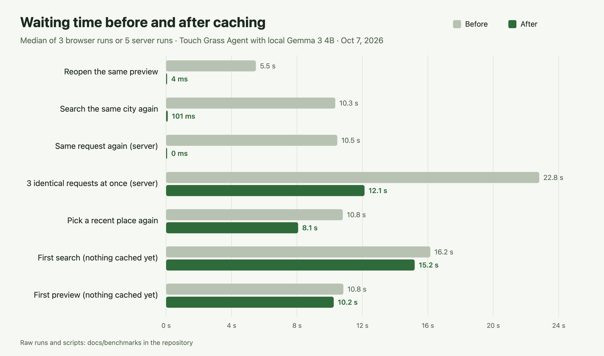

# Caching: before and after

The app caches work it has already done: suggestions, weather and air quality, place searches, routes, park
features, park photos, typed cities, and recorded preview videos. "How it works" in the [README](../../README.md)
describes each cache and how long it lasts. This page measures what that changed.



## Summary

- Across a six-step session (search a city, open the preview, reopen it, pick a recent place, search the same
  city again, reload and preview again), the total wait went from **58.8 s to 39.2 s (−33%)**.
- Reopening the same preview went from **5.5 s to 4 ms**: the recorded video plays again instead of loading the
  map and photos and drawing the film.
- Searching the same city again went from **10.3 s to 0.1 s**: the city's coordinates and the suggestion are both
  reused.
- The same request went from **10.5 s to 0 ms**, and three identical requests at once from **22.8 s to 12.1 s**,
  because Gemma answers once instead of three times.
- Per server session, calls to outside APIs went from **28 to 17 (−39%)** and calls to Gemma from **8 to 5**.

## Method

- **Versions:** commit `bbfec09` (before caching) and commit `cbc471f` (after), each checked out in its own git
  worktree with its own server and web ports, so both run side by side on the same machine and network.
- **Alternating runs:** each round runs "before", then "after", so changes in network speed or Gemma load affect
  both the same way. The tables show medians.
- **Server:** 5 sessions per version. Each session is a fresh Node process with empty caches and runs six
  scenarios in order, starting from Seoul City Hall with 60 minutes. Every outgoing `fetch` is counted, with Gemma
  (Ollama on port 11434) counted separately.
- **Data gathering:** the same scenarios with only `getConditions` (weather, air quality, places, features, and
  routes, without Gemma), 5 sessions per version.
- **Browser:** 3 runs per version in headless Chrome at 430×860. Each run starts a fresh server and a fresh browser
  profile, so the browser's own cache starts empty too. The time is from the action until the result or the
  preview is on screen. Network counts leave out requests the browser served from its cache.
- **Machine:** a MacBook running Gemma 3 4B locally through Ollama, with real calls to Open-Meteo, Nominatim,
  Overpass, OSRM, Mapillary, and Wikimedia Commons, on October 7, 2026.

## Results

### Browser (median of 3 runs)

| Scenario | Before | After | Network requests | Transferred |
|---|---|---|---|---|
| Search a city (first time) | 16.2 s | 15.2 s | 10 → 10 | 125 KB → 126 KB |
| Open the preview (first time) | 10.8 s | 10.2 s | 25 → 26 | 5335 KB → 5148 KB |
| Reopen the same preview | 5.5 s | 4 ms | 3 → 0 | 438 KB → 0 KB |
| Pick a recent place again | 10.8 s | 8.1 s | 6 → 2 | 5 KB → 5 KB |
| Search the same city again | 10.3 s | 0.1 s | 5 → 2 | 6 KB → 5 KB |
| Preview after a page reload | 5.2 s | 5.6 s | 17 → 17 | 440 KB → 3 KB |

### Server, full suggestion (median of 5 sessions)

| Scenario | Before | After | Outside API calls | Gemma calls |
|---|---|---|---|---|
| First request | 12.5 s | 12.3 s | 5 → 5 | 1 → 1 |
| Same request again | 10.5 s | 0 ms | 2 → 0 | 1 → 0 |
| Another place | 12.2 s | 12.2 s | 5 → 3 | 1 → 1 |
| Recent place again | 9.1 s | 10.0 s | 2 → 1 | 1 → 1 |
| Start about 300 m away | 9.6 s | 9.4 s | 5 → 3 | 1 → 1 |
| 3 identical requests at once | 22.8 s | 12.1 s | 9 → 5 | 3 → 1 |

### Server, data gathering only (median of 5 sessions)

| Scenario | Before | After | Outside API calls |
|---|---|---|---|
| First request | 3.1 s | 2.2 s | 5 → 5 |
| Same request again | 966 ms | 677 ms | 2 → 1 |
| Another place | 3.0 s | 1.4 s | 5 → 3 |
| Recent place again | 625 ms | 1.4 s | 3 → 1 |
| Start about 300 m away | 3.0 s | 1.2 s | 5 → 3 |

## What didn't get faster, and why

- **First visits** have nothing to reuse yet, so the first search and the first preview take about as long as
  before.
- **Gemma takes most of a suggestion** (about 7 to 12 seconds). Caching the data around it saves 1 to 2 seconds,
  which is within Gemma's own variation; the total only drops sharply when Gemma isn't asked again (the same
  request, or identical requests at the same time).
- **Preview after a reload** downloads 3 KB of photos instead of 440 KB, because the photo addresses stay the same
  and the browser keeps them. The ready time doesn't improve, because warming up the 3D map tiles (up to 12
  seconds) decides it.
- **Recent place in data gathering** made fewer outside calls (3 → 1) but had a higher median. During the runs the
  public Overpass server started limiting requests, so some runs waited the full 3 seconds for park features.

## Reproduce

Ollama must be running with `gemma3:4b`, Google Chrome installed (or `CHROME` set to its path), and ports 8788,
8789, 5174, and 5175 free. Optional API keys are read from `apps/server/.env` as usual.

```sh
node scripts/bench/compare.mjs bbfec09 cbc471f     # 5 server and 3 browser runs per version, about 25 minutes
node scripts/bench/compare.mjs bbfec09 cbc471f 1 1 # a quick single run
node scripts/bench/compare.mjs --summary           # print the medians of the saved results
```

The script writes every run to `docs/benchmarks/results/` (`server.jsonl`, `conditions.jsonl`, `browser.jsonl`)
and removes its worktrees when it finishes. The scenarios themselves are in `scripts/bench/server.mjs`,
`scripts/bench/conditions.mjs`, and `scripts/bench/browser.mjs`. The benchmark sends a few hundred requests to the
public Nominatim, Overpass, and OSRM servers, so run it sparingly.
